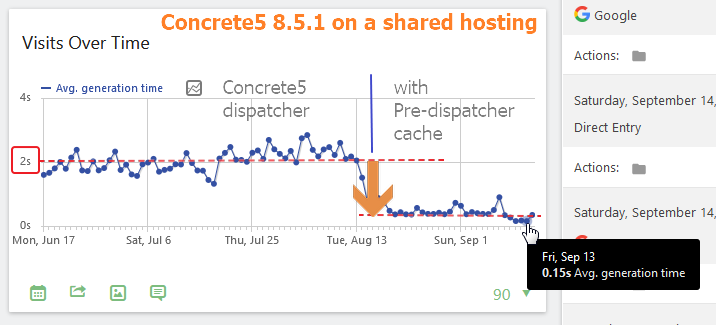
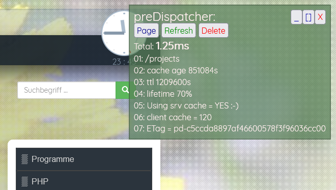

# Pre Dispatcher #

## Description ##

The preDispatcher is a cache in front of a slow website delivery/ cms. Initially it was created for my website with Concrete5 on a shared hoster. But it could be used for other products too.
It is written for websites running on a shared hosting where people cannot install caching services like varshish.

To see the real life example: go to https://www.axel-hahn.de/ and navigate around.

In my use case Concrete5 needed about 1.5 sec for a non cached page ... and still 200 ms to deliver a website with enabled "full page" cached content. The footprint for the bootstrap process is quite high. This pre-dispatcher catches a request and puts it to a cache. It deliveres the local cache file for a given time. So delivering the content starts in 1 ms (instead of 200 ms).

Author: Axel Hahn
Source: https://github.com/axelhahn/pre-dispatcher

## Status ##

BETA ... it is used on my own website. 
I need to abstract it to make it usable for other tools.

## Licence ##

This is free software and Open Source 
GNU General Public License (GNU GPL) version 3

## Requirements ##

* PHP 7 or 8

Means: just plain PHP - no database, no special modules. It can be used on any shared hosting.

## Features ##

* Minimal requirements: it can be used on any shared hoster (it just needs file access - no database, no other service or module)
* It is a fast full page cache for GET requests to handle slow backends. Other request methods won't be cached.
* Caching of pages with GET parameters (you need to define exclusions of variable names if not to cache them)
* automatic deletion of cached entries (if you are in a backend: define cookie or session variable names to delete a page cache)
* Delete or touch a single file to flush all older cache entries (i.e. for changes in a layout template)
* force the refresh of a cached content
* automatic refresh of pages that expire soon
* debugging features to follow the behaviour:
   * enable/ disable debugging
   * limit visibility of debug infos to defined ip addresses
   * write debug into http response header and/ or as html code
* Live cache infos on the top right during browsing (needs to be enabled for a given ip address)

## Continue ... ##

**Basics**
* [Installation](docs/install.md)
* [Config](docs/config.md)

**Maintanance**

* [Cleanup](docs/cleanup.md)
* [Refresh](docs/refresh.md)